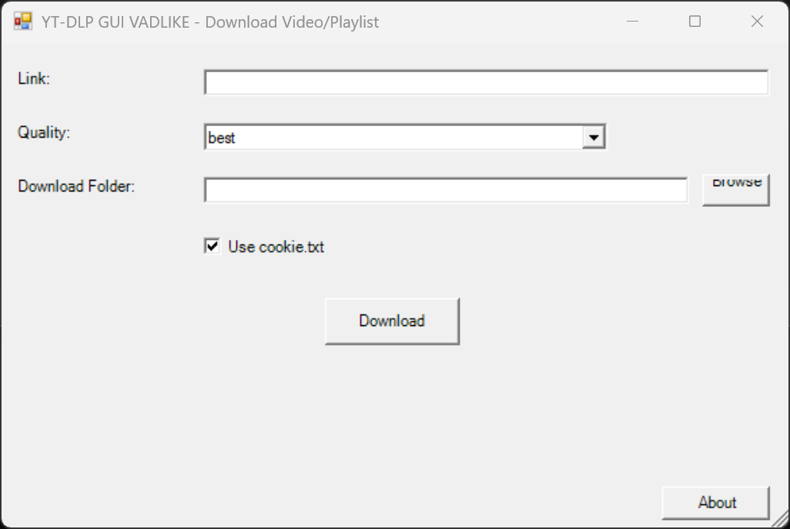

# 🎥 YT-DLP GUI by VADLIKE

A simple and user-friendly **PowerShell GUI wrapper** for [yt-dlp](https://github.com/yt-dlp/yt-dlp),  allowing you to easily download videos, playlists, and audio from YouTube and other platforms — without touching the command line.

---

## 🔗 Important Links

- **Download latest version:**  
  👉 [YT-DLP GUI VADLIKE - Download](https://github.com/vadlike/yt-dlp-GUI-VADLIKE/releases/tag/1) 

- **How to get `cookie.txt` (for private content):**  
  👉 [Get cookies.txt (Locally)](https://chromewebstore.google.com/detail/get-cookiestxt-locally/cclelndahbckbenkjhflpdbgdldlbecc) 

- **Official yt-dlp page (developers):**  
  👉 [yt-dlp GitHub](https://github.com/yt-dlp/yt-dlp) 

---

## 📷 Screenshots

---

## ⚙️ How to Run (Windows)

1. **Download the archive:**
   - [YT-DLP GUI VADLIKE Windows.7z](https://github.com/vadlike/yt-dlp-GUI-VADLIKE/releases/tag/1) 

2. **Extract it** into any folder on your computer.

3. **Run the file:**

  
4. The program window will open. You can now:
- Paste a video or playlist URL
- Select quality
- Choose a download folder
- Click **"Download"**

> 💡 If using cookies, place the `cookie.txt` file in the same folder as the script.

---

## 📌 Features

- Download videos in various qualities: 4K, 1080p, 720p, and more
- Extract audio only (best, 192kbps, or 128kbps)
- Choose custom download folder
- Supports cookies via `cookie.txt`
- Simple graphical interface
- Built-in "About" button linking to this repository 😊

---

## 🛠 Requirements

- Windows 8 or later
- PowerShell 5+
- .NET Framework installed (usually pre-installed)

---

## 📦 License

MIT License – see [LICENSE](LICENSE) for details.

---

## 👤 Author

🔗 [VADLIKE on GitHub](https://github.com/vadlike) 

GitHub Repository:  
👉 [https://github.com/vadlike/yt-dlp-GUI-VADLIKE](https://github.com/vadlike/yt-dlp-GUI-VADLIKE) 
